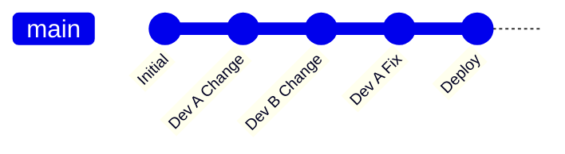
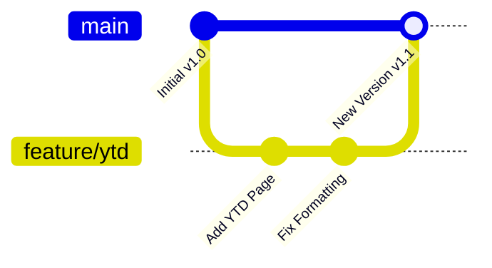
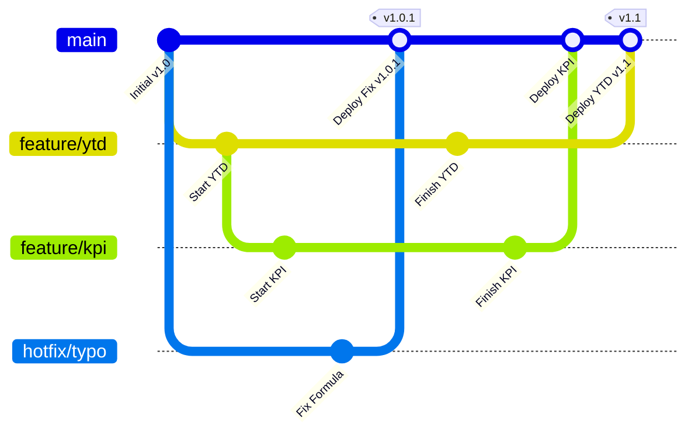

# Git Basics Deep Dive for Power BI Developers

If you are new to Git, this guide will bridge the gap between "Saving a File" and "Version Control."

---

## 1. Core Concepts (Plain English)

Forget the command line for a second. Here is what Git actually *does*.

| Git Concept | Power BI Equivalent |
| :--- | :--- |
| **Repository (Repo)** | The folder that holds your entire project history. Think of it as a super-powered "Folder" that remembers everything. |
| **Commit** | A "Save Point." Unlike clicking Save in Desktop (which overwrites the file), a Commit saves a *snapshot* of the changes. You can always go back to this point. |
| **Branch** | A parallel universe. You can create a branch called `new-visuals`, delete everything, and your `main` branch remains untouched. |
| **Merge** | Combining two universes. Taking the changes from `new-visuals` and applying them to `main`. |
| **Remote** | The version of your repo that lives on the internet (Azure DevOps, GitHub). **Note:** In this guide, we focus on *Local Git*, so your "Remote" is just you! |

---

## 2. Choosing a Workflow: Why "Feature Branching"?

There are many ways to use Git. For Power BI, we recommend **Feature Branching**.

### The "SharePoint Method" (Bad)
Everyone edits the same `Sales.pbix` file.
*   **Result**: Last writer wins. Previous work is lost. Zero history.

### The "Trunk-Based" Method (Advanced)
Everyone pushes directly to `main` every few hours.


*   **Result**: Hard for Power BI because you might break the report for everyone while you are halfway through a measure.

### The "Feature Branch" Method (Recommended)

#### Level 1: The Basic Workflow
This is where you should start. You simply want to work on a new feature without risking the working report.

1.  **Start on Main**: Generally safe and deployable.
2.  **Branch Out**: Create `feature/ytd-page`.
3.  **Work**: Do all your messy work here. If you break it, `main` is still safe.
4.  **Merge**: When perfect, bring it back to `main`.



#### Level 2: Real World Scenario (Parallel Work & Critical Fixes)
Once you master the basics, here is why Feature Branching is a superpower for teams.

Imagine you are building "YTD Page" (taking 2 weeks), your colleague is building "KPI Card" (taking 3 days), and suddenly a critical bug is found in PROD.



*   **Key Takeaway**: The "Fix Formula" hotfix went to PROD *immediately*, without waiting for the unfinished "YTD" or "KPI" work. This is impossible with a single shared PBIX file.

---

## 3. The "Worktree" Power Move

In standard software development, you switch branches like this:
1.  Close your code editor.
2.  Run `git checkout feature-B`.
3.  Re-open editor.

**In Power BI, this hurts.**
Closing Power BI Desktop, waiting for it to open, and reloading data takes time.

### Enter `git worktree`
Instead of switching *in place*, you create a **parallel folder**.

*   **Main Folder**: `C:\Projects\Sales-Report` (Checked out to `main`)
*   **Feature Folder**: `C:\Projects\Sales-Report-FeatureA` (Checked out to `feature/A`)

You can have **both** open in two different Power BI Desktop windows at the same time.

### How to do it

#### 1. Setup your folders
Move your repo to a base folder.
`C:\Work\PowerBI-Repo`

#### 2. Create a standardized folder structure
Instead of leaving your files in the root, maybe keep your "Main" branch in a folder named `main`.

#### 3. Create a worktree for a new feature
Open your terminal in `C:\Work\PowerBI-Repo\main`:

```powershell
# Syntax: git worktree add <path-to-new-folder> <branch-name>
git worktree add ../feature-ytd feature/ytd
```

Now you have:
*   `C:\Work\PowerBI-Repo\main` (Safely on Main)
*   `C:\Work\PowerBI-Repo\feature-ytd` (Safely on Feature/YTD)

**You can work on both simultaneously.**

#### 4. Cleanup
When you are done and have merged `feature/ytd` back to main:

```powershell
# 1. Close Power BI Desktop for the feature folder
# 2. Run this command from the main folder:
git worktree remove ../feature-ytd
```

---

## 4. Tools for the "No-Code" User

You don't *have* to use VS Code. While VS Code is best for editing the text files, you can use other tools just for the "Git" part.

### GitHub Desktop
A friendly, visual app.
*   **Pros**: click buttons to Commit, Branch, and Undo. Visual diffs.
*   **Cons**: Doesn't support `git worktree` natively (you have to use command line for that).

### SourceTree / GitKraken
Powerful visual Git clients.
*   **Pros**: Great graph visualization.

### The Command Line (PowerShell)
The universal language. If you learn the 5 commands in the Cheat Sheet, you can work on any machine, anywhere.
