# Deployment & CI/CD Strategy

Moving code from your local machine to Production is the most critical part of the engineering lifecycle. 

In a "Local Git" environment (without Azure DevOps automation), we rely on **Power BI Service Deployment Pipelines** to manage this flow safely.

## The Deployment Pipeline (Manual Promotion)

Since we are manually publishing from Desktop, we need a gatekeeper in the cloud to prevent us from overwriting Production with half-finished work.

### The Flow
1.  **Local Development**: You work on a feature branch, merge it to `main`.
2.  **Publish to DEV**: content from the `main` branch is published to the **DEV Workspace**.
3.  **Promote to TEST**: Use the Pipeline to move content to the Test stage.
4.  **Promote to PROD**: After verification, move content to Production.

```mermaid
flowchart LR
    Local[("Local Git\n(feature -> main)")] -->|Publish| DevWS
    subgraph "Power BI Service Deployment Pipeline"
        DevWS[("DEV Workspace")]
        TestWS[("TEST Workspace")]
        ProdWS[("PROD Workspace")]
        
        DevWS -->|"Deploy ⚡"| TestWS
        TestWS -->|"Deploy 🚀"| ProdWS
    end
```

### Step-by-Step

1.  **Merge to Main**: Ensure your local `main` branch is up to date and contains the changes you want to release.
2.  **Publish**: Open the `.pbip` in Desktop and publish to your **DEV** workspace.
    > **Note**: Never publish directly to Test or Prod. DEV is your only entry point.
3.  **Promote**: 
    - Go to the Power BI Service.
    - Open your Deployment Pipeline.
    - Click **"Deploy to [Next Stage]"**.
4.  **Pipeline Rules**: 
    - Configure **Deployment Rules** in the pipeline settings to change parameters between stages.
    - *Example*: In DEV, point to `SQL_Dev`. In TEST, the pipeline automatically swaps this to `SQL_QA`.

## Advanced: The Future of Automation (CI/CD)

While this guide focuses on the manual "Publish to DEV" workflow, large enterprises often automate this using **Azure DevOps (ADO)** or **GitHub Actions**.

> **Note**: This requires premium licenses (Fabric/Premium Capacity) and access to Service Principals.

### What is "Headless" Deployment?
Instead of you clicking "Publish", a script does it for you.

1.  You push code to GitHub/Azure Repos.
2.  A **Pipeline** (script) wakes up.
3.  It runs **Tabular Editor CLI** to validate your DAX (checking for errors).
4.  It uses the **Power BI REST API** or **Fabric Git Integration** to deploy the changes to the workspace automatically.

### Why do this?
- **Quality Gates**: The script can reject your code if it fails tests (e.g., "All measures must have a description").
- **Consistency**: No accidental "oops, I published to the wrong workspace."

*If you are interested in this, search for "Power BI Fabric Git Integration" or "Power BI CI/CD with Azure DevOps".*
