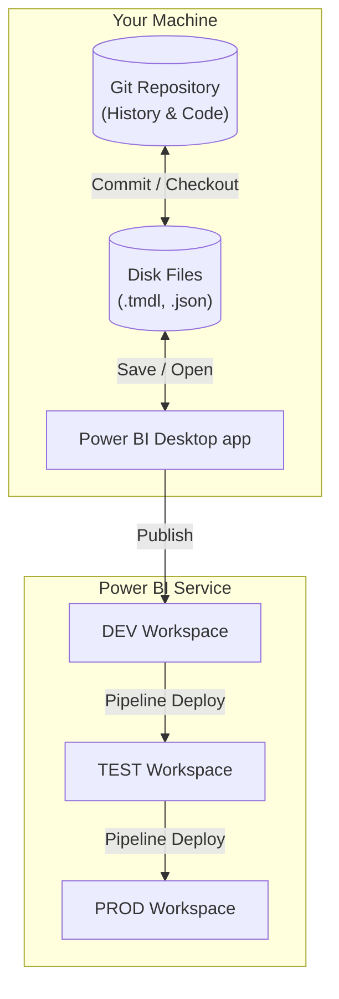

# Master Power BI with Local Git: A Community Guide

*Turn your "save-as" chaos into a professional engineering workflow—no premium licenses required.*

**Prerequisite Reading**: If terms like "Commit", "Branch", or "Worktree" are new to you, read our [Git Basics Deep Dive](./git-basics-deep-dive.md) first.

---

## 1. Why Git? (vs OneDrive/SharePoint)

You might ask: *"Why not just save to SharePoint? It has version history."*

| Feature | SharePoint / OneDrive | Git (PBIP) |
| :--- | :--- | :--- |
| **History** | "Version 54" (Who changed what? No idea.) | "Added YTD Measure in Sales Table" (Detailed log) |
| **Parallel Work** | Blocked. "File is locked for editing by Dave." | **Yes**. Dave works on Sales, you work on Finance. Merge later. |
| **Rollback** | Restore entire huge PBIX file. | Revert just *one* specific measure or visual change. |
| **Diffing** | Impossible. Binary comparison. | **Line-by-line**. See exactly what DAX changed. |
| **Hotfixes** | Impossible. If you find a bug in PROD but DEV is 2 weeks ahead, you can't fix PROD without overwriting it. | **Easy**. Create a branch from `main` (PROD state), fix the bug, merge to `main`, and deploy. DEV remains untouched. |

**The Game Changer: PBIP (Power BI Project)**
Power BI Desktop now saves as an open folder structure of text files (`.tmdl`, `.json`). This makes Git possible.

---

## 2. Setup & The Critical `.gitignore`

### Repository Structure
Stop thinking "one file." Start thinking "Repository."

```text
/my-analytics-repo
├── .gitignore              <-- The most important file
├── README.md               <-- Documentation
└──src/
   ├── Sales.Report/        <-- PBIP Folder
   └── Sales.Dataset/       <-- PBIP Folder
```

### The `.gitignore` Exploded
Power BI generates local cache files. Committing these bloats your repo and causes conflicts.

| File Type | Why Ignore it? |
| :--- | :--- |
| `*.abf` | **Analysis Services Backup File**. This is the data cache. It can be huge. Do not version control data; version control *definitions*. |
| `*.mbr` | **Model Backup**. Internal backup used by the engine. |
| `*.cache` | Temporary cache files. |
| `localSettings.json` | Your specific user settings (e.g., "Last Page Viewed"). Dave doesn't need to open the page you were looking at. |
| `unappliedChanges.json`| **Power Query Lock**. If you save while "Apply Changes" is pending. Always apply changes before committing! |

**Copy-Paste this into your `.gitignore`:**
```gitignore
*.abf
*.mbr
*.cache
*.pbix
localSettings.json
unappliedChanges.json
```

---

## 3. The Lifecycle: Git ↔ Desktop ↔ Service

How does data move?



> [!WARNING]
> **The Stale Cache**: When you publish from Desktop to Service, you send the *Model Schema* and *Report Layout*.
>
> *Question*: "If I refresh in Desktop first, does the data upload?"
> *Answer*: It depends. Use established CI/CD best practices: Treat the Service as the source of truth for data. Even if you upload data, a scheduled refresh is safer to ensure consistency.
> **Rule**: Always trigger a **Refresh** in the Service immediately after publishing.

---

## 4. The Three Edit Loops

Modern Power BI development isn't just "Clicking in Desktop" anymore.

### Loop A: Desktop-First (Standard)
*Best for: Visuals, Bookmarks, Power Query touches, and using **Copilot in Desktop**.*
**Concept**: You use the UI as intended.
1.  Open text-based PBIP in Desktop.
2.  Make changes (drag visuals, use Copilot pane).
3.  **Save** (Writes from memory -> disk).
4.  Commit in Git.

### Loop B: Code-First (VS Code / External)
*Best for: Bulk measure edits, Search/Replace, copying logic between reports.*
**Pros**: Fast, powerful editing.
**Cons**: Power BI Desktop does NOT "watch" files. It won't see your changes until you reload.

**Workflow**:
1.  **Close Power BI Desktop**.
2.  Edit `.tmdl` files in VS Code.
3.  Save files.
4.  Open Power BI Desktop (Changes load on startup).

### Loop C: AI-First (MCP Agent)
*Best for: "Create 10 measures", "Document my model".*
**What is this?** An "MCP Server" is a bridge that lets an AI (like Claude or ChatGPT) talk directly to the Power BI engine running on your machine.
**Pros**: Magic. Agent interacts with the live model in memory.
**Cons**: Danger of "Ghost Code" (In memory but not on disk).

**Workflow**:
1.  Helper Agent connects to your *running* Desktop session.
2.  Agent sends DAX/TMSL commands directly to the engine.
3.  **Visual Verification**: You see the measures appear instantly in your open Desktop window.
4.  **CRITICAL STEP**: Click **Save** in Power BI Desktop.
    *   *Why?* The Agent updated the *Memory*. Clicking Save writes Memory -> *Disk*.
5.  Commit in Git.

---

## 5. Branching & Worktrees

**Scenario**: You are working on `Feature-A`. The boss demands a fix for `Prod` immediately.

### The Problem with "In-Place" Switching
In normal coding, you run `git checkout main`.
In Power BI:
1.  Git tries to swap 100 files underneath Power BI Desktop.
2.  Power BI Desktop holds locks on files.
3.  **CRASH** or Corruption.

### The Solution: Git Worktrees
See our [Git Deep Dive](./git-basics-deep-dive.md#3-the-worktree-power-move) for the technical "How-To".

**Concept**:
Instead of *changing* the files in `C:\MyRepo`, you run a command that tells Git: *"Create a brand new folder over there, and fill it with the files from Key-Feature branch."*

**Result**:
- **Folder A (Main)**: `C:\MyRepo\Main` (Open in Desktop).
- **Folder B (Feature)**: `C:\MyRepo\Feature` (Created by Git, open in *another* Desktop window).
- **Zero Risk** of file locking conflicts.

**What happens to the folders?**
When you are done, you run `git worktree remove ...` and Git deletes the temporary folder for you. It keeps your hard drive clean.

---

## 6. Service Promotion Flow (DEV → TEST → PROD)

Since we are Local Git only (no Azure DevOps in the middle), we use **Deployment Pipelines**.

1.  **Local**: Merge `feature` -> `main`.
2.  **Publish**: Open `main` in Desktop -> Publish to **DEV Workspace**.
3.  **Promote**: Go to Power BI Service -> Deployment Pipelines.
    -   Click "Deploy to Test".
    -   *Pipelines are smart*: They preserve your "Test" connection strings (e.g., pointing to a QA SQL database instead of Dev).
4.  **Verify**: Check the report in TEST.
5.  **Deploy**: Click "Deploy to Prod".

---

## 7. I don't use VS Code. Can I do this?

**Yes.**
While VS Code is the gold standard for editing TMDL, you can use **GitHub Desktop**, **SourceTree**, or the **Command Line** just for the Git part.

*   **Editing**: Continue using Power BI Desktop as your only editor.
*   **Versioning**: Use the external Git tool to "Snapshot" your folder every time you make progress.

**Caveat**: You lose the ability to resolve merge conflicts line-by-line easily. If you get a conflict in `report.json`, it might be hard to fix without a code editor.

---

## 8. Troubleshooting

### "My Repo is huge!"
- **Cause**: You likely committed the data cache (`.abf`) or an accidental `.pbix` backup.
- **Fix**: Check `.gitignore`. Add `*.abf`. Run `git rm --cached *.abf`.

### "I edited the TMDL file but don't see changes."
- **Fact**: Desktop loads definition into memory on open. It does NOT watch for file changes.
- **Fix**: Re-open the `.pbip` file in Desktop.

### "Merge Conflicts in `report.json`"
- **Pain**: Two people moved the same visual.
- **Real Talk**: JSON merging is hard.
- **Fix**: Pick "Their Version" or "My Version" completely. Then manually re-do the missing small change in Desktop.

